# Help Explorer for Visual Studio Tutorial

The Help Explorer for Visual Studio is an Visual Studio extension that adds a
Help Explorer tool window that provides contextual help and resources based on
Solution Explorer’s current Project of File selection.

## This Tutorial is broken down into two sections: See Outline below.

1.  Beginners, Students and Hobby Developers

    - Basics on using Help Explorer to Find and Learn from Help Explorer provided URL links based on the current project or file selected in Solution Explorer.

    - Help Explorer Tools Option Settings.

        1. Display single or multiple project type URL links.

        2. Display single or multiple file type URL links.

        3. Create or do not create local Template Project Capabilities files.

        4. Local Template Project Capabilities file save path.

    - Help Explorer Tools Window, Toolbar Buttons.

        1. Display single or multiple project type URL links.

        2. Display single or multiple file type URL links.

        3. Create or do not create local Template Project Capabilities files.

1.  Experienced Developers or Visual Studio 2022 Template Developers

    - How to update your Visual Studio 2022 Custom Project Template Extensions to provide Custom Project Capabilities.

    - How to update Help Explorer’s projecttypes.json and filetypes.json file.

        1. projecttypes

            - capability.

            - capabilityExpression

            - capabilitiesFileName

            - text

            - links

                - text

                - url

        1. Filetypes

            - Name

            - text

            - links

                - text

                - url

    - How to filter the Project Types URL links, for Help, Tutorials or Guides, based on the updated Custom Template Project Capabilities.


## Section 1: Beginners, Students and Hobby Developers

Help Explorer has built in URL links for know project and file types. If you do not get a link for a selected project or file type please become a contributer to:
[Help Explorer](https://github.com/madskristensen/HelpExplorer) on [GitHub](https://github.com/).

### Using Help Explorer:

If Visual Studio is running? Shut it down, by Using:
```csharp
 Select File Menu, Then Exit
```
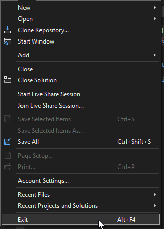

Install HelpExplorer.vsix extension from [HelpExplorer](https://www.vsixgallery.com/extension/HelpExplorer.c8c773f3-d62f-4717-9b7d-1d3e440a7d53) at the [Open VSIX Gallery](https://www.vsixgallery.com/) or from the [Visual Studio Marketplace](https://marketplace.visualstudio.com/).

Once you have Help Explorer extension installed:

- [ ] launch Visual Studio 2022.
- [ ] Create new C# WPF Application Project.

    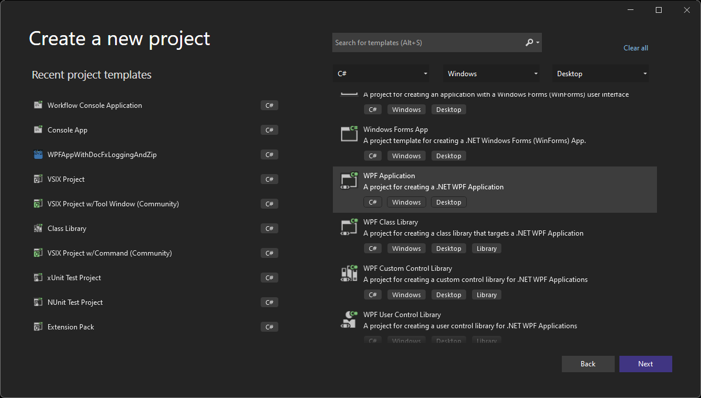

- [ ] Select the MainWindow.xaml file in Solution Explorer.

    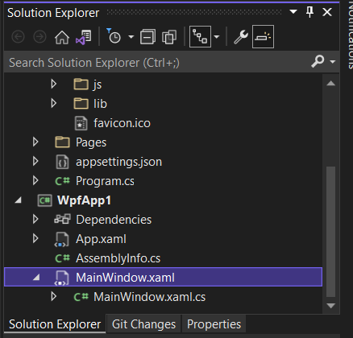

- [ ] Load Help Explorer ToolWindow for the first time.

    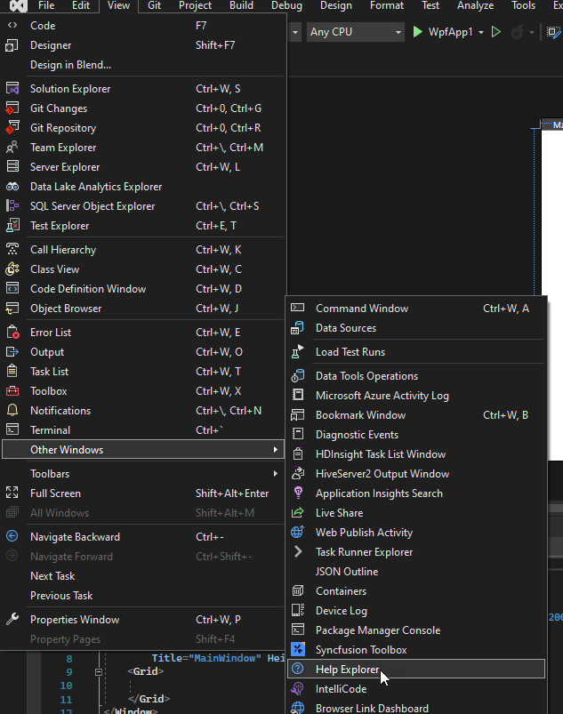

Help Explorer ToolWindow displays and shows links for selected project and file.

 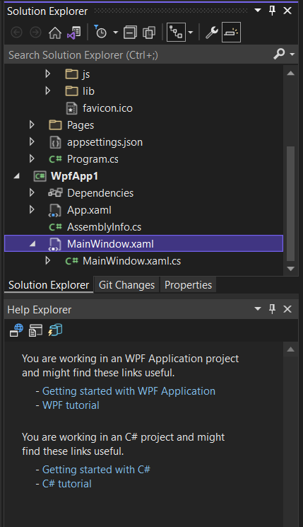

- [ ] Change selected file from .xaml to .CS.
 
    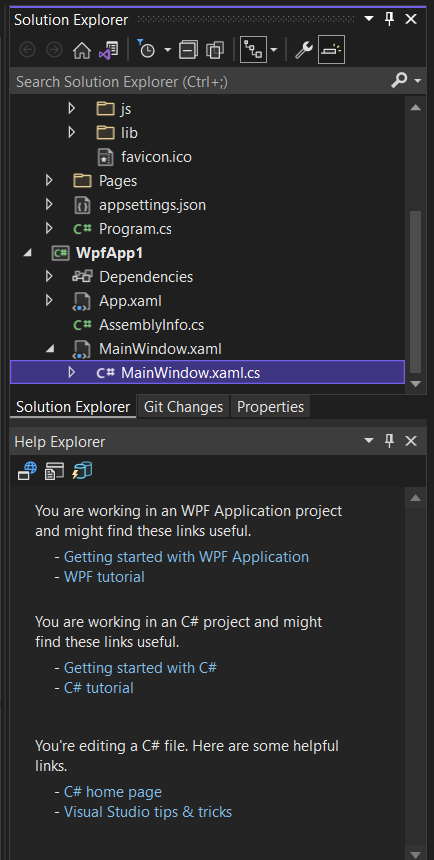

### Help Explorer Tools Option Settings.

1. Display single or multiple project type URL links.

The defaults are shown.
    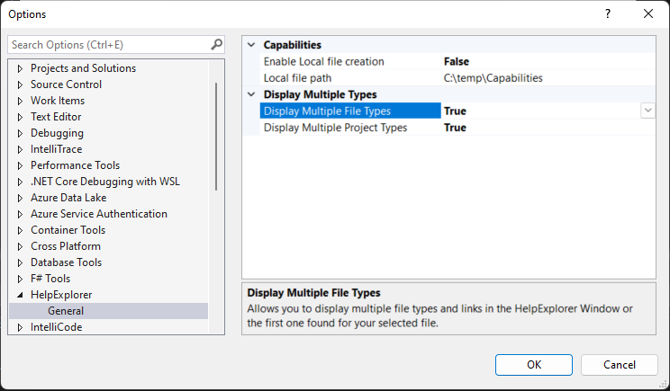

Change the 'Display Multiple Projects Types value to true or false.

True will display multiple links for a project type.

False will only display the first link returned for a project type.

2. Display single or multiple file type URL links.

    

Change the 'Display Multiple File Types value to true or false.

True will display multiple links for a file type.

False will only display the first link returned for a file type.

3. Create or do not create local Template Project Capabilities files.

Enable Local File Creation is a true or false value. True to create local file.

4. Local Template Project Capabilities file save path.

> **Note: User must user rights to create files in the local path location entered.**


### Help Explorer Tools Window, Toolbar Buttons.

The Help Explorer Tools Window Toolbar buttons allow you to change the Help Explorer Options easily.

Each button Click changes the current Help Explorer Option from true to false of from false to true, and then refreshes the display of the links.

1. Display single or multiple project type URL links.

    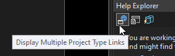

2. Display single or multiple file type URL links.

    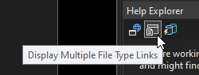

3. Create or do not create local Template Project Capabilities files.

    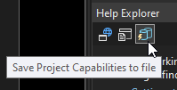

## Section 2: Experienced Developers or Visual Studio 2022 Template Developers

### How to update your Visual Studio 2022 Custom Project Template Extensions to provide Custom Project Capabilities.

If you are the owner of the Custom or built in Visual Studio Project Template you can very easily add Project Capabilities to your project template.

> **It's very important that project capabilities you define fit this [criteria](https://github.com/Microsoft/VSProjectSystem/blob/master/doc/overview/about_project_capabilities.md):**
> 
Open you Visual Studio SDK Style Project Template 
(Note: This is the project template .csproj contained in the Visual Studio Extension Project located under the ProjectsTemplates folder.) 
You may need to unzip the Project Template to get access to the .csproj file.

Open the .csproj file for your SDK Style project. It should look similar to this .csproj snippet
Note: This snippet sample already has Custom Project Capabilities added.

```xml
<Project Sdk="Microsoft.NET.Sdk">

  <PropertyGroup>
    <OutputType>WinExe</OutputType>
    <TargetFramework>net6.0-windows</TargetFramework>
    <UseWPF>true</UseWPF>
    <Platforms>x64</Platforms>
    <RuntimeIdentifier>win10-x64</RuntimeIdentifier>
    <AssemblyVersion>1.0.0.0</AssemblyVersion>
	  <FileVersion>1.0.0.0</FileVersion>
	  <StartupObject>$safeprojectname$.App</StartupObject>
  </PropertyGroup>
	<ItemGroup>
		<ProjectCapability Include="DiagnoseCapabilities" />
		<ProjectCapability Include="Microsoft.Extensions.Logging" />
		<ProjectCapability Include="Docfx.Console" />
		<ProjectCapability Include="System.IO.Compression"/>
	</ItemGroup>

```
 
Now to add the Custom Project Capabilities to the .csproj file.

```xnk
	<ItemGroup>
		<ProjectCapability Include="DiagnoseCapabilities" />
		<ProjectCapability Include="Microsoft.Extensions.Logging" />
		<ProjectCapability Include="Docfx.Console" />
		<ProjectCapability Include="System.IO.Compression"/>
	</ItemGroup>

```

The DiagnoseCapabilities option will list all current available Project Templates in your Project under Solution Explorer.
If you do not want to always list all the Project Capablities in your deployed template then remove this line.

```xml
<ProjectCapability Include="DiagnoseCapabilities" />

```

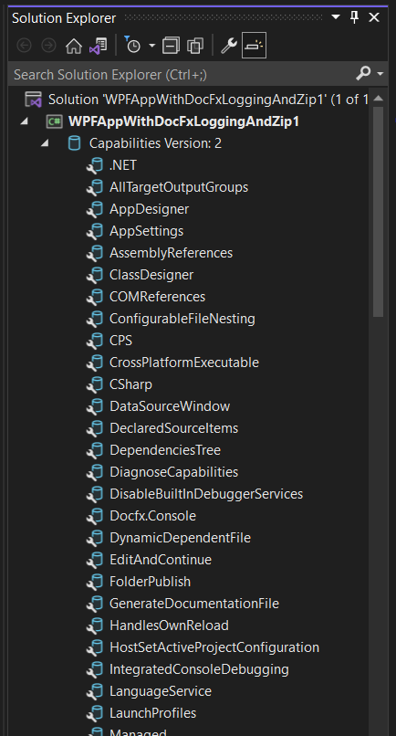

The remaining ProjectCapability lines will show listed in your projects deploy template.
These are examples and should not be included unless your project template supports them.

For example: If you had [VSIXWPFAppWithDocFxLoggingAndZip](https://marketplace.visualstudio.com/items?itemName=DannyMcNaught.WPFAppWithDocFxLoggingAndZip2022) project template installed.

 The above example has the ProjectCapabilitiy listed so with project loaded based on that template,
Help Explorer will display these links: (Note: Right below the Project name in Solution Explorer the first
ProjectCapability list shows up as "Capablilities Version: 2" the version can be ignored.)

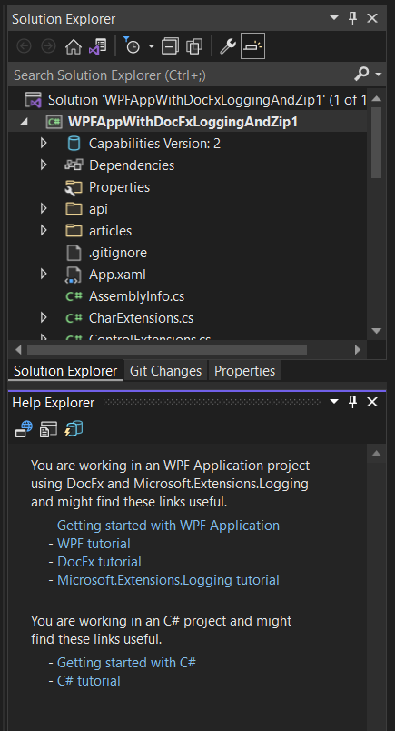


## How to update Help Explorer’s projecttypes.json and filetypes.json file.

To make you custom project capabilities available to Help Explorer and to the development community
 using Help Explorer you must contribute to Help Explorer Project and add your custom project capabliities to the projecttypes.json file.

Once you modify the projecttypes.json or the filetypes.json you must commit it and submit a pull request to the project owner. 

Once they accept your pull request and merge it to master, the users will be able to update to that version or higher of Help Explorer and now have your custom project capabilities and help url links available.

#### Example of projecttypes.json file:

```json
{
  "projecttypes": [
    {
      "capability": "",
      "capabilityExpression": "",
      "capabilitiesFileName": "",
      "text": "No project loaded.",
      "links": [
        {
          "text": "Getting started with Visual Studio",
          "url": "https://visualstudio.microsoft.com/vs/"
        },
        {
          "text": "Visual Studio tips & tricks",
          "url": "https://channel9.msdn.com/Events/Visual-Studio/Visual-Studio-2022-Launch-Event/Tips-and-Tricks-Optimizing-build-performance"
        }
      ]
    },
    {
      "capability": "AspNetCore",
      "capabilityExpression": "(AspNetCore & CSharp) & CPS",
      "capabilitiesFileName": "AspNetCore_CSharp_CPS",
      "text": "You are working in an ASP.NET Core project and might find these links useful.",
      "links": [
        {
          "text": "Getting started with ASP.NET Core",
          "url": "https://dotnet.microsoft.com/apps/aspnet"
        },
        {
          "text": "ASP.NET Core tutorial",
          "url": "https://docs.microsoft.com/en-us/aspnet/core/tutorials/razor-pages/?view=aspnetcore-6.0"
        }
      ]
    },
    {
      "capability": "DotNetCoreWeb",
      "capabilityExpression": "(DotNetCoreWeb & CSharp) & CPS",
      "capabilitiesFileName": "DotNetCoreWeb_CSharp_CPS",
      "text": "You are working in an ASP.NET Core Web project and might find these links useful.",
      "links": [
        {
          "text": "Getting started with ASP.NET Core Web",
          "url": "https://docs.microsoft.com/en-us/visualstudio/ide/quickstart-aspnet-core?view=vs-2022"
        },
        {
          "text": "ASP.NET Core Web tutorial",
          "url": "https://docs.microsoft.com/en-us/visualstudio/get-started/csharp/tutorial-aspnet-core?view=vs-2022"
        }
      ]
    },
    {
      "capability": "MauiBlazor",
      "capabilityExpression": "(MauiBlazor & CSharp) & CPS",
      "capabilitiesFileName": "MauiBlazor_CSharp_CPS",
      "text": "You are working in an Maui Blazor .NET Core project and might find these links useful.",
      "links": [
        {
          "text": "Getting started with Maui Blazor.NET Core",
          "url": "https://docs.microsoft.com/en-us/shows/xamarinshow/introduction-to-net-maui-blazor--the-xamarin-show"
        },
        {
          "text": "Getting started with .NET MAUI Project and Item Templates",
          "url": "https://marketplace.visualstudio.com/items?itemName=egvijayanand.maui-templates"
        },
        {
          "text": "Razor tutorial",
          "url": "https://docs.microsoft.com/en-us/aspnet/core/tutorials/razor-pages/?view=aspnetcore-6.0"
        }
      ]
    },
    {
      "capability": "WPF & DocFx.Console & Microsoft.Extensions.Logging",
      "capabilityExpression": "(WPF & CSharp) & (CPS & CrossPlatformExecutable) & (DocFx.Console & Microsoft.Extensions.Logging)",
      "capabilitiesFileName": "WPF_CSharp_CPS_DocFx_Logging",
      "text": "You are working in an WPF Application project using DocFx and Microsoft.Extensions.Logging and might find these links useful.",
      "links": [
        {
          "text": "Getting started with WPF Application",
          "url": "https://docs.microsoft.com/en-us/dotnet/desktop/wpf/overview/?view=netdesktop-6.0"
        },
        {
          "text": "WPF tutorial",
          "url": "https://docs.microsoft.com/en-us/dotnet/desktop/wpf/get-started/create-app-visual-studio?view=netdesktop-6.0"
        },
        {
          "text": "DocFx tutorial",
          "url": "https://docs.microsoft.com/en-us/shows/on-net/intro-to-docfx"
        },
        {
          "text": "Microsoft.Extensions.Logging tutorial",
          "url": "https://docs.microsoft.com/en-us/dotnet/core/extensions/logging?tabs=command-line"
        }
      ]
    },
    {
      "capability": "WPF",
      "capabilityExpression": "(WPF & CSharp) & (CPS & CrossPlatformExecutable) & (!DocFx.Console & !Microsoft.Extensions.Logging)",
      "capabilitiesFileName": "WPF_CSharp_CPS",
      "text": "You are working in an WPF Application project and might find these links useful.",
      "links": [
        {
          "text": "Getting started with WPF Application",
          "url": "https://docs.microsoft.com/en-us/dotnet/desktop/wpf/overview/?view=netdesktop-6.0"
        },
        {
          "text": "WPF tutorial",
          "url": "https://docs.microsoft.com/en-us/dotnet/desktop/wpf/get-started/create-app-visual-studio?view=netdesktop-6.0"
        }
      ]
    },
    {
      "capability": "WPFLibrary",
      "capabilityExpression": "(WPF & CSharp) & (CPS & !CrossPlatformExecutable)",
      "capabilitiesFileName": "WPFLibrary_CSharp_CPS",
      "text": "You are working in an WPF Library project and might find these links useful.",
      "links": [
        {
          "text": "Getting started with WPF Library",
          "url": "https://docs.microsoft.com/en-us/dotnet/desktop/wpf/overview/?view=netdesktop-6.0"
        },
        {
          "text": "WPF library tutorial",
          "url": "https://docs.microsoft.com/en-us/dotnet/desktop/wpf/get-started/create-app-visual-studio?view=netdesktop-6.0"
        }
      ]
    },
    {
      "capability": "WindowsForms",
      "capabilityExpression": "(WindowsForms & CSharp) & (CPS & CrossPlatformExecutable)",
      "capabilitiesFileName": "WindowsForms_CSharp_CPS",
      "text": "You are working in an WindowsForms .NET Core project and might find these links useful.",
      "links": [
        {
          "text": "Getting started with WindowsForms .NET Core",
          "url": "https://docs.microsoft.com/en-us/dotnet/core/compatibility/windows-forms/6.0/application-bootstrap"
        },
        {
          "text": "WindowsForms .NET Core tutorial",
          "url": "https://docs.microsoft.com/en-us/visualstudio/ide/create-csharp-winform-visual-studio?view=vs-2022"
        }
      ]
    },
    {
      "capability": "WindowsForms",
      "capabilityExpression": "(WindowsForms & CSharp) & (CPS & !CrossPlatformExecutable)",
      "capabilitiesFileName": "WindowsForms_ClassLibrary_CSharp_CPS",
      "text": "You are working in an WindowsForms Class Library .NET Core project and might find these links useful.",
      "links": [
        {
          "text": "Getting started with WindowsForms Class Library .NET Core",
          "url": "https://docs.microsoft.com/en-us/dotnet/core/compatibility/windows-forms/6.0/application-bootstrap"
        },
        {
          "text": "WindowsForms Class Library .NET Core tutorial",
          "url": "https://docs.microsoft.com/en-us/visualstudio/ide/create-csharp-winform-visual-studio?view=vs-2022"
        }
      ]
    },
    {
      "capability": "WindowsXAML",
      "capabilityExpression": "(WindowsXAML & CSharp) & !CPS",
      "capabilitiesFileName": "Universal_Windows_Platform_CSharp",
      "text": "You are working in an UWP project and might find these links useful.",
      "links": [
        {
          "text": "Getting started with UWP",
          "url": "https://docs.microsoft.com/en-us/windows/uwp/get-started/universal-application-platform-guide"
        },
        {
          "text": "UWP tutorial",
          "url": "https://docs.microsoft.com/en-us/visualstudio/get-started/csharp/tutorial-uwp?view=vs-2022"
        }
      ]
    },
    {
      "capability": "WinUI3",
      "capabilityExpression": "(WinUI & CSharp) & (CPS & WapProj)",
      "capabilitiesFileName": "WinUI_WapProj_CSharp_CPS",
      "text": "You are working in an WinUI WapProj .Net Core project and might find these links useful.",
      "links": [
        {
          "text": "Getting started with WinUI WapProj .Net Core",
          "url": "https://docs.microsoft.com/en-us/windows/uwp/get-started/universal-application-platform-guide"
        },
        {
          "text": "WinUI WapProj .Net Core tutorial",
          "url": "https://docs.microsoft.com/en-us/visualstudio/get-started/csharp/tutorial-uwp?view=vs-2022"
        }
      ]
    },
    {
      "capability": "WinUI3",
      "capabilityExpression": "(WinUI & CSharp) & (CPS & Msix) & !WapProj",
      "capabilitiesFileName": "WinUI_App_Msix__CSharp_CPS",
      "text": "You are working in an WinUI Application Package Msix .Net Core project and might find these links useful.",
      "links": [
        {
          "text": "Getting started with WinUI Application Package Msix .Net Core",
          "url": "https://docs.microsoft.com/en-us/windows/uwp/get-started/universal-application-platform-guide"
        },
        {
          "text": "WinUI Application Package Msix .Net Core tutorial",
          "url": "https://docs.microsoft.com/en-us/visualstudio/get-started/csharp/tutorial-uwp?view=vs-2022"
        }
      ]
    },
    {
      "capability": "WinUI3ClassLibrary",
      "capabilityExpression": "(WinUI & CSharp) & (CPS & !WapProj)",
      "capabilitiesFileName": "WinUI_ClassLibrary_CSharp_CPS",
      "text": "You are working in an WinUI Class Library .Net Core project and might find these links useful.",
      "links": [
        {
          "text": "Getting started with WinUI Class Library .Net Core",
          "url": "https://docs.microsoft.com/en-us/windows/apps/winui/"
        },
        {
          "text": "WinUI Class Library .Net Core tutorial",
          "url": "https://docs.microsoft.com/en-us/windows/apps/winui/winui3/"
        }
      ]
    },
    {
      "capability": "VSIX",
      "capabilityExpression": "(VSIX & CSharp) & !CPS",
      "capabilitiesFileName": "VSIX_CSharp",
      "text": "You are working in an Visual Studio Extensibility project and might find these links useful.",
      "links": [
        {
          "text": "Getting started with Visual Studio Extensibility",
          "url": "https://docs.microsoft.com/en-us/visualstudio/extensibility/getting-started-with-the-vsix-project-template?view=vs-2022"
        },
        {
          "text": "Visual Studio Extensibility tutorial",
          "url": "https://docs.microsoft.com/en-us/visualstudio/extensibility/extensibility-hello-world?view=vs-2022"
        }
      ]
    },
    {
      "capability": "TestContainer",
      "capabilityExpression": "(TestContainer & CSharp) & CPS",
      "capabilitiesFileName": "NUnit_CSharp_CPS",
      "text": "You are working in an NUnit Test .NET Core project and might find these links useful.",
      "links": [
        {
          "text": "Getting started with NUnit Test in .NET Core",
          "url": "https://docs.microsoft.com/en-us/dotnet/core/testing/unit-testing-with-nunit"
        },
        {
          "text": "NUnit Test .NET Core tutorial",
          "url": "https://docs.microsoft.com/en-us/dotnet/core/testing/unit-testing-best-practices"
        }
      ]
    },
    {
      "capability": "CSharp",
      "capabilityExpression": "(CSharp & CPS)",
      "capabilitiesFileName": "CSharp_CPS",
      "text": "You are working in an C# project and might find these links useful.",
      "links": [
        {
          "text": "Getting started with C#",
          "url": "https://docs.microsoft.com/en-us/dotnet/csharp/tour-of-csharp/"
        },
        {
          "text": "C# tutorial",
          "url": "https://docs.microsoft.com/en-us/dotnet/csharp/tour-of-csharp/tutorials/"
        }
      ]
    }
  ]
}
```


### Projecttypes.json Schema:

        1. projecttypes

            - capability = The user friendly capability name.

            - capabilityExpression = The capability expression uses the requirements in the link below to filter project capabilities included in selected project.
[IVsBooleanSymbolExpressionEvaluator.EvaluateExpression(String, String) Method](https://docs.microsoft.com/en-us/dotnet/api/microsoft.visualstudio.shell.interop.ivsbooleansymbolexpressionevaluator.evaluateexpression?redirectedfrom=MSDN&view=visualstudiosdk-2022#Microsoft_VisualStudio_Shell_Interop_IVsBooleanSymbolExpressionEvaluator_EvaluateExpression_System_String_System_String_)

So if the capabilityExpression = 
```csharp
capabilityExpression = "(WPF & CSharp) & (CPS & CrossPlatformExecutable) & (!DocFx.Console & !Microsoft.Extensions.Logging)",
```
This means Display project type links if the project is:

Is a CSharp and WPF application
and is a (CPS Common Project System) Core and CrossPlatform Executable
and does not have project capabilities DocFx.Console and does not have Microsoft.Extensions.Logging.

This is important if you do not want project cababilities for custom WPF and CSharp project links to display twice.
You can limited the project links for common and custom project capabilities used in the same project by using these filters.

            - capabilitiesFileName = This is the name of the file, If the Help Explorer Option is set to save the project capabilities to a local file.

The local path can be changed in: Visual Studio Tools Options HelpExplorer General "Local File Path". 

> **Note: User must user rights to create files in the local path location entered.**

            - text = The friendly text to display to the user in the Help Explorer Tool Window.

            - links

                - text = The friendly text to display to the user for the URL link.

                - url = The URL of the web link to the help content related to the selected custom or built-in project type

#### Example of filetypes.json file:

```json
{
  "filetypes": [
    {
      "name": "",
      "text": "No file loaded.",
      "links": [
        {
          "text": "Getting started with Visual Studio",
          "url": "https://visualstudio.microsoft.com/vs/"
        },
        {
          "text": "Visual Studio tips & tricks",
          "url": "https://channel9.msdn.com/Events/Visual-Studio/Visual-Studio-2022-Launch-Event/Tips-and-Tricks-Optimizing-build-performance"
        }
      ]
    },
    {
      "name": ".fs",
      "text": "You're editing a F# file. Here are some helpful links.",
      "links": [
        {
          "text": "F# home page",
          "url": "https://dotnet.microsoft.com/languages/fsharp"
        },
        {
          "text": "Visual Studio tips & tricks",
          "url": "https://channel9.msdn.com/Events/Visual-Studio/Visual-Studio-2022-Launch-Event/Tips-and-Tricks-Optimizing-build-performance"
        }
      ]
    },
    {
      "name": ".fsproj",
      "text": "You're editing a F# project file. Here are some helpful links.",
      "links": [
        {
          "text": "F# project file home page",
          "url": "https://docs.microsoft.com/en-us/visualstudio/msbuild/msbuild-project-file-schema-reference?view=vs-2022"
        },
        {
          "text": "Visual Studio tips & tricks",
          "url": "https://channel9.msdn.com/Events/Visual-Studio/Visual-Studio-2022-Launch-Event/Tips-and-Tricks-Optimizing-build-performance"
        }
      ]
    },
    {
      "name": ".vb",
      "text": "You're editing a Visual Basic file. Here are some helpful links.",
      "links": [
        {
          "text": "Visual home page",
          "url": "https://docs.microsoft.com/en-us/dotnet/visual-basic/?WT.mc_id=dotnet-35129-website"
        },
        {
          "text": "Visual Studio tips & tricks",
          "url": "https://channel9.msdn.com/Events/Visual-Studio/Visual-Studio-2022-Launch-Event/Tips-and-Tricks-Optimizing-build-performance"
        }
      ]
    },
    {
      "name": ".vbproj",
      "text": "You're editing a Visual Basic project file. Here are some helpful links.",
      "links": [
        {
          "text": "Visual Basic project file home page",
          "url": "https://docs.microsoft.com/en-us/visualstudio/msbuild/msbuild-project-file-schema-reference?view=vs-2022"
        },
        {
          "text": "Visual Studio tips & tricks",
          "url": "https://channel9.msdn.com/Events/Visual-Studio/Visual-Studio-2022-Launch-Event/Tips-and-Tricks-Optimizing-build-performance"
        }
      ]
    },
    {
      "name": ".cs",
      "text": "You're editing a C# file. Here are some helpful links.",
      "links": [
        {
          "text": "C# home page",
          "url": "https://dotnet.microsoft.com/languages/csharp"
        },
        {
          "text": "Visual Studio tips & tricks",
          "url": "https://channel9.msdn.com/Events/Visual-Studio/Visual-Studio-2022-Launch-Event/Tips-and-Tricks-Optimizing-build-performance"
        }
      ]
    },
    {
      "name": ".razor",
      "text": "You're editing a razor file. Here are some helpful links.",
      "links": [
        {
          "text": "razor home page",
          "url": "https://docs.microsoft.com/en-us/aspnet/core/razor-pages/?view=aspnetcore-6.0&tabs=visual-studio"
        },
        {
          "text": "Razor Tutorial",
          "url": "https://docs.microsoft.com/en-us/aspnet/core/tutorials/razor-pages/?view=aspnetcore-6.0"
        }
      ]
    },
    {
      "name": ".csproj",
      "text": "You're editing a C# project file. Here are some helpful links.",
      "links": [
        {
          "text": "C# project file home page",
          "url": "https://docs.microsoft.com/en-us/visualstudio/msbuild/msbuild-project-file-schema-reference?view=vs-2022"
        },
        {
          "text": "Visual Studio tips & tricks",
          "url": "https://channel9.msdn.com/Events/Visual-Studio/Visual-Studio-2022-Launch-Event/Tips-and-Tricks-Optimizing-build-performance"
        }
      ]
    },
    {
      "name": ".xaml",
      "text": "You're editing a xaml file. Here are some helpful links.",
      "links": [
        {
          "text": "XAML overview",
          "url": "https://docs.microsoft.com/en-us/dotnet/desktop/wpf/xaml/?view=netdesktop-6.0"
        },
        {
          "text": "Visual Studio tips & tricks",
          "url": "https://channel9.msdn.com/Events/Visual-Studio/Visual-Studio-2022-Launch-Event/Tips-and-Tricks-Optimizing-build-performance"
        }
      ]
    },
    {
      "name": ".cshtml",
      "text": "You're editing a HTML file. Here are some helpful links.",
      "links": [
        {
          "text": "C# home page",
          "url": "https://dotnet.microsoft.com/languages/csharp"
        },
        {
          "text": "Visual Studio tips & tricks",
          "url": "https://channel9.msdn.com/Events/Visual-Studio/Visual-Studio-2022-Launch-Event/Tips-and-Tricks-Optimizing-build-performance"
        }
      ]
    },
    {
      "name": ".css",
      "text": "You're editing a CSS file. Here are some helpful links.",
      "links": [
        {
          "text": "CSS home page",
          "url": "https://dotnet.microsoft.com/languages/csharp"
        },
        {
          "text": "Visual Studio tips & tricks",
          "url": "https://channel9.msdn.com/Events/Visual-Studio/Visual-Studio-2022-Launch-Event/Tips-and-Tricks-Optimizing-build-performance"
        }
      ]
    },
    {
      "name": ".json",
      "text": "You're editing a json file. Here are some helpful links.",
      "links": [
        {
          "text": "Newtonsoft json home page",
          "url": "https://www.newtonsoft.com/json"
        },
        {
          "text": "System.Text.Json home page",
          "url": "https://docs.microsoft.com/en-us/dotnet/api/system.text.json?view=net-6.0"
        },
        {
          "text": "Visual Studio tips & tricks",
          "url": "https://channel9.msdn.com/Events/Visual-Studio/Visual-Studio-2022-Launch-Event/Tips-and-Tricks-Optimizing-build-performance"
        }
      ]
    },
    {
      "name": ".js",
      "text": "You're editing a javascript file. Here are some helpful links.",
      "links": [
        {
          "text": ".js home page",
          "url": "https://dotnet.microsoft.com/languages/csharp"
        },
        {
          "text": "Visual Studio tips & tricks",
          "url": "https://channel9.msdn.com/Events/Visual-Studio/Visual-Studio-2022-Launch-Event/Tips-and-Tricks-Optimizing-build-performance"
        }
      ]
    },
    {
      "name": ".appxmanifest",
      "text": "You're editing a .Net Maui file. Here are some helpful links.",
      "links": [
        {
          "text": ".Net Maui home page",
          "url": "https://docs.microsoft.com/en-us/dotnet/maui/what-is-maui"
        },
        {
          "text": "Visual Studio tips & tricks",
          "url": "https://channel9.msdn.com/Events/Visual-Studio/Visual-Studio-2022-Launch-Event/Tips-and-Tricks-Optimizing-build-performance"
        }
      ]
    },
    {
      "name": ".manifest",
      "text": "You're editing a manifest file. Here are some helpful links.",
      "links": [
        {
          "text": "manifest home page",
          "url": "https://docs.microsoft.com/en-us/windows/win32/sbscs/application-manifests"
        },
        {
          "text": "Visual Studio tips & tricks",
          "url": "https://channel9.msdn.com/Events/Visual-Studio/Visual-Studio-2022-Launch-Event/Tips-and-Tricks-Optimizing-build-performance"
        }
      ]
    },
    {
      "name": ".xml",
      "text": "You're editing a xml file. Here are some helpful links.",
      "links": [
        {
          "text": "xml home page",
          "url": "https://docs.microsoft.com/en-us/dotnet/standard/data/xml/"
        },
        {
          "text": "Visual Studio tips & tricks",
          "url": "https://channel9.msdn.com/Events/Visual-Studio/Visual-Studio-2022-Launch-Event/Tips-and-Tricks-Optimizing-build-performance"
        }
      ]
    },
    {
      "name": ".svg",
      "text": "You're editing a svg file. Here are some helpful links.",
      "links": [
        {
          "text": "svg home page",
          "url": "https://docs.microsoft.com/en-us/visualstudio/extensibility/ux-guidelines/images-and-icons-for-visual-studio?view=vs-2022"
        },
        {
          "text": "Visual Studio tips & tricks",
          "url": "https://channel9.msdn.com/Events/Visual-Studio/Visual-Studio-2022-Launch-Event/Tips-and-Tricks-Optimizing-build-performance"
        }
      ]
    },
    {
      "name": ".ico",
      "text": "You're editing a ico file. Here are some helpful links.",
      "links": [
        {
          "text": "ico home page",
          "url": "https://docs.microsoft.com/en-us/visualstudio/extensibility/ux-guidelines/images-and-icons-for-visual-studio?view=vs-2022"
        },
        {
          "text": "Visual Studio tips & tricks",
          "url": "https://channel9.msdn.com/Events/Visual-Studio/Visual-Studio-2022-Launch-Event/Tips-and-Tricks-Optimizing-build-performance"
        }
      ]
    },
    {
      "name": ".png",
      "text": "You're editing a png file. Here are some helpful links.",
      "links": [
        {
          "text": "png home page",
          "url": "https://docs.microsoft.com/en-us/visualstudio/extensibility/ux-guidelines/images-and-icons-for-visual-studio?view=vs-2022"
        },
        {
          "text": "Visual Studio tips & tricks",
          "url": "https://channel9.msdn.com/Events/Visual-Studio/Visual-Studio-2022-Launch-Event/Tips-and-Tricks-Optimizing-build-performance"
        }
      ]
    }
  ]
}
```

### Filetypes.json Schema:

        1. Filetypes

            - Name = The user friendly file type (i.e. CSharp for .cs files) name.

            - text = The friendly text to display to the user in the Help Explorer Tool Window.

            - links

                - text = The friendly text to display to the user for the URL link.

                - url  = The URL of the web link to the help content related to the selected file type


